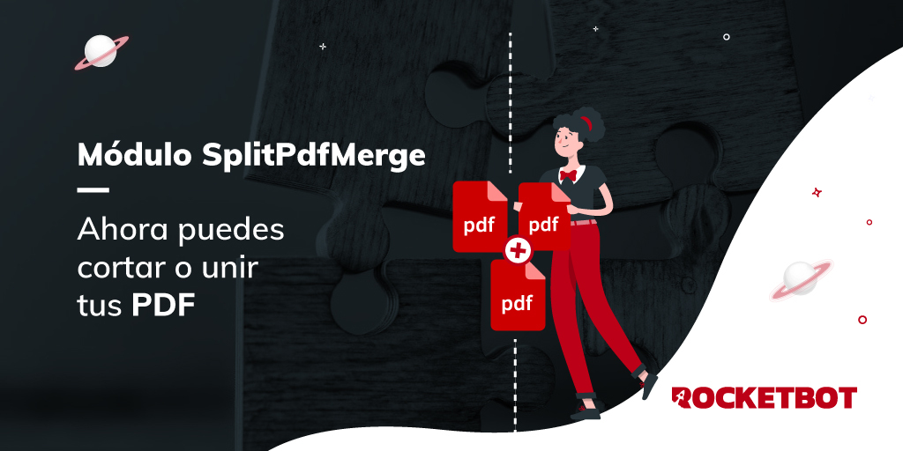

# SplitPdfMerge
  
Módulo para dividir y juntar pdfs  
  

## Como instalar este módulo
  
__Descarga__ e __instala__ el contenido en la carpeta 'modules' en la ruta de rocketbot.  

## Como usar este módulo
Para usar este módulo, tienes que proporcionar el o los PDF/s y ejecutar las funciones 
necesarias.

## Descripción de los comandos

### Dividir pdf
  
Divide un pdf 
|Parámetros|Descripción|ejemplo|
| --- | --- | --- |
|PDF de entrada|Ruta donde se encuentra el archivo PDF.|C:/Users/User/Downloads/sample.pdf|
|Path y nombre de la carpeta donde guardar el pdf|Ruta que se desea usar para guardar los PDF resultantes.|C:/Users/User/Desktop/PDF|
|Cada cuantas páginas dividir|Número que se usará para saber cada cuantas páginas se dividirá el PDF..|1|

### Combinar pdfs
  
Combina pdfs en un pdf común
|Parámetros|Descripción|ejemplo|
| --- | --- | --- |
|Ruta de la carpeta con los pdfs|Ruta contenedora de PDF a los cuales combinar.|C:/Users/User/Desktop/PDF|
|Path y nombre del archivo donde guardar el pdf|Ruta que se desea usar para guardar el PDF.|C:/Users/User/Desktop/PDF/merge.pdf|

### Enctriptar pdf
  
Agrega una contraseña a un pdf 
|Parámetros|Descripción|ejemplo|
| --- | --- | --- |
|PDF a encriptar|Ruta que contiene el PDF para enciptar.|C:/Users/User/Downloads/sample.pdf|
|Path y nombre del archivo donde guardar el pdf|Ruta que se desea usar para guardar el PDF resultante.|C:/Users/User/Downloads/sample.pdf|
|Clave|Clave que se desea usar para encriptar.|s3cr3t-p4ss|

### Leer pdf Encriptado
  
Lee un pdf con contraseña
|Parámetros|Descripción|ejemplo|
| --- | --- | --- |
|PDF encriptado|Ruta donde se encuentra el PDF encriptado.|C:/Users/User/Downloads/sample.pdf|
|Clave|Clave que se usar para desencriptar.|s3cr3t-p4ss|
|Asignar resultado a la variable|Variable para guardar el resultado de la lectura del PDF.|pdf_leido|

### Desencriptar PDF
  
Desencriptar PDF con contraseña
|Parámetros|Descripción|ejemplo|
| --- | --- | --- |
|PDF encriptado|Ruta donde se encuentra el PDF encriptado.|C:/Users/User/Downloads/sample.pdf|
|Clave|Clave que se usar para desencriptar.|s3cr3t-p4ss|
|Guardar PDF desencriptado|Ruta donde guardar el PDF desencriptado.|C:/Users/User/Downloads/output.pdf|

### Dividir pdf en páginas específicas
  
Divide un pdf en un paso específico.
|Parámetros|Descripción|ejemplo|
| --- | --- | --- |
|PDF de entrada|Ruta donde se encuentra el archivo PDF.|C:/Users/User/Downloads/sample.pdf|
|Path y nombre de la carpeta donde guardar el pdf|Ruta que se desea usar para guardar los PDF resultantes.|C:/Users/User/Desktop/PDF|
|Como dividr el PDF|Forma en la cual se desea dividir el PDF.|['1-3', 4-5']|
